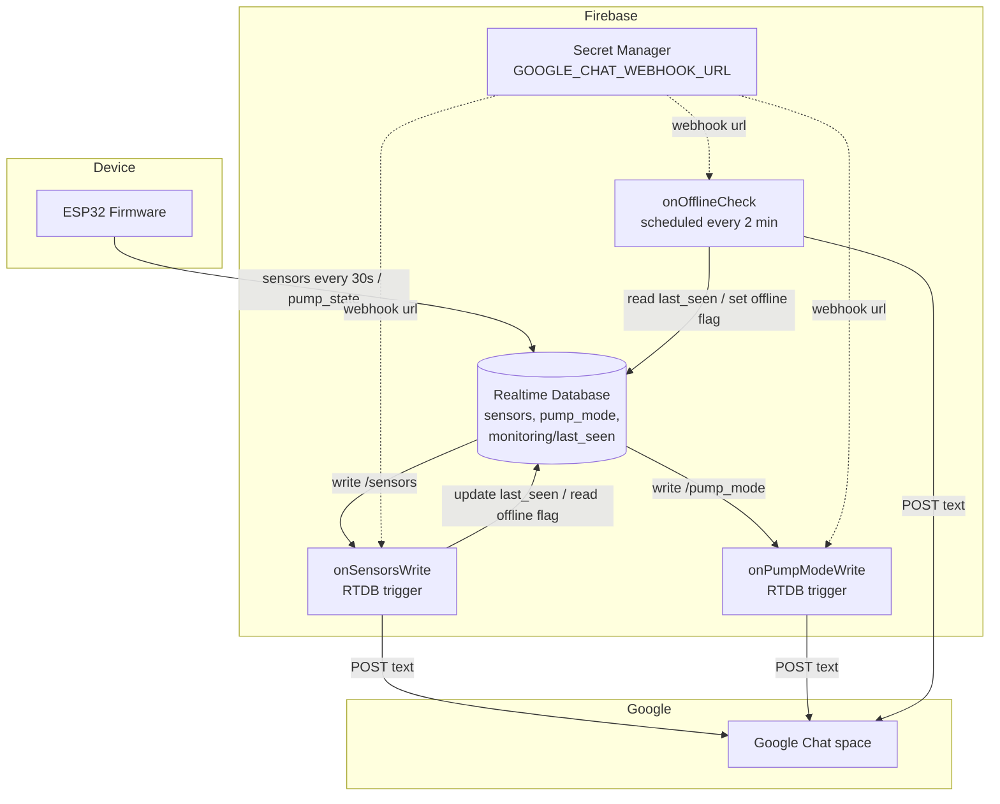

# Design Document — Google Chat Monitoring Alerts

## Overview

A backend-only subsystem (`functions/`) that turns Realtime Database state changes into
Google Chat notifications for the farm owner. Firebase Cloud Functions (2nd gen) subscribe to
RTDB writes and a schedule; pure decision logic decides whether an event is alert-worthy and
builds the message text; a thin sender POSTs it to a Google Chat incoming webhook. Nothing in
the firmware, web client, or Flutter app changes.

### Key Design Decisions

- **Server-side, event-driven.** Functions react to RTDB writes regardless of any open client,
  and the webhook secret stays server-side (never in the browser bundle or firmware).
- **Edge-triggered.** The sensor reporter writes every 30 s; alerts fire only on a transition
  (before ≠ after), so the channel is not flooded. Decision logic is pure and unit-tested.
- **Heartbeat + scheduled watchdog for offline.** Each sensor write stamps `last_seen`; a
  scheduled function flags a device offline once when `last_seen` goes stale, and a subsequent
  sensor write clears the flag with a "back online" notice.
- **Incoming webhook over a Chat app.** One-way notifications to a known space need only a
  webhook — no service account, Workspace admin, or OAuth.
- **IaC-consistent.** The webhook lives in Secret Manager (provisioned by Terraform); functions
  deploy via the same Firebase-CLI-in-`local-exec` pattern used for rules/seed/hosting.

---

## Architecture



---

## Components and Interfaces

### Package layout (`functions/`)

```
functions/
  package.json  tsconfig.json  tsconfig.build.json  vitest.config.ts
  src/
    monitoring.ts   # pure: edge detection, offline check, message builders (no Firebase)
    chat.ts         # sendChatMessage(webhookUrl, text) via global fetch
    index.ts        # onSensorsWrite, onPumpModeWrite, onOfflineCheck
  test/
    monitoring.test.ts   chat.test.ts
```

### 1. Pure logic (`monitoring.ts`)

```ts
export const OFFLINE_THRESHOLD_MS = 3 * 60 * 1000;
export type WaterEvent = 'low' | 'restored' | null;

waterLevelEvent(before, after): WaterEvent   // 'low' iff after && !before; 'restored' iff !after && before
pumpModeChanged(before, after): boolean       // after non-empty && before !== after
isOffline(lastSeen, now, thresholdMs): boolean// false if lastSeen null; else now-lastSeen > threshold

buildWaterLowMessage(ref) / buildWaterRestoredMessage(ref)
buildOfflineMessage(ref, minutes) / buildOnlineMessage(ref)
buildPumpModeMessage(ref, before, after)
```

### 2. Sender (`chat.ts`)

```ts
export async function sendChatMessage(webhookUrl: string, text: string): Promise<void>;
// POST { text } as JSON; throw on non-OK response.
```

### 3. Triggers (`index.ts`)

- **`onSensorsWrite`** — RTDB `onValueWritten('/farms/{farmId}/towers/{towerId}/sensors')`,
  region `europe-west1`, secret `GOOGLE_CHAT_WEBHOOK_URL`:
  1. update `monitoring/last_seen = now` (heartbeat);
  2. if `offline_notified` was true → clear it and send "back online";
  3. `waterLevelEvent(before.water_level_low, after.water_level_low)` → send low / restored.
- **`onPumpModeWrite`** — RTDB `onValueWritten('.../pump_mode')`: if `pumpModeChanged` → send.
- **`onOfflineCheck`** — `onSchedule('every 2 minutes')`: for each tower, if `isOffline` and not
  already notified → set `offline_notified` and send offline alert.

The RTDB trigger region must equal the database region (`rtdb_region`, default `europe-west1`).

### 4. Infrastructure (Terraform)

- `main.tf` — enables Cloud Functions/Build, Artifact Registry, Cloud Run, Eventarc, Pub/Sub,
  Cloud Scheduler, Secret Manager APIs.
- `functions.tf` — `google_secret_manager_secret` + version for `GOOGLE_CHAT_WEBHOOK_URL`.
- `deploy.tf` — `null_resource.functions_deploy` runs `firebase deploy --only functions`,
  `depends_on` the RTDB instance and the secret version; gated by `deploy_functions`.
- `firebase.json` — `functions` codebase with a build predeploy hook.

---

## Data Models

### Monitoring node (new, under each tower)

```
farms/{farmId}/towers/{towerId}/monitoring/
  last_seen:        Integer  (epoch ms of last sensor write — written by function)
  offline_notified: Boolean  (true while an offline alert is outstanding)
```

Written only by the functions (Admin SDK, which bypasses the allowlist rules). Allowlisted
users may read it; clients never need to write it.

### Chat payload

```json
{ "text": "🚨 *Критично: низький рівень води* ..." }
```

Messages are Ukrainian plain text with a leading emoji per severity (🚨 / ✅ / ⚠️ / 🟢 / ℹ️).

---

## Correctness Properties

### Property N1: Water Level Alerts Are Edge-Triggered
*For any* before/after booleans, `waterLevelEvent` returns `'low'` iff `after && !before`,
`'restored'` iff `!after && before`, and `null` when unchanged (including every heartbeat write
where the value is stable). **Validates: Requirements 2.1, 2.2, 3.1, 3.2, 7.1**

### Property N2: Pump Mode Alert Only On Change
*For any* before/after strings, `pumpModeChanged` is true iff `after` is non-empty and differs
from `before`. **Validates: Requirements 6.1, 6.2**

### Property N3: Offline Threshold Semantics
*For any* `lastSeen` and `now`, `isOffline` is `false` when `lastSeen` is null, and otherwise
true iff `now - lastSeen > threshold`. **Validates: Requirements 4.2, 4.4**

### Property N4: Offline Alert Fires At Most Once
While a device remains offline, the scheduled check sends exactly one alert (guarded by
`offline_notified`); a later sensor write clears the flag. **Validates: Requirements 4.3, 5.1**

### Property N5: Webhook Sender Contract
`sendChatMessage` POSTs `{ text }` as JSON to the webhook and throws on a non-OK response.
**Validates: Requirements 1.1, 1.3**

### Property N6: Messages Identify Farm/Tower and Intent
Each builder includes the farm id, tower id, and an intent-specific phrase.
**Validates: Requirements 2.1, 3.1, 4.2, 6.1**

---

## Error Handling

| Scenario | Handling |
|---|---|
| Webhook non-OK / network error | `sendChatMessage` throws → function invocation is marked failed and retried per platform policy |
| Missing/empty secret | Deploy-time: function has no webhook; document that `google_chat_webhook_url` is required when `deploy_functions = true` |
| Unchanged value write (heartbeat) | Pure edge detection returns `null` → no message |
| Seed write (`water_level_low = false`, no prior) | `waterLevelEvent(undefined,false)` → `null` → no spurious "restored" |
| Never-seen device | `isOffline(null, …)` → `false` → no false offline alert |
| Duplicate offline ticks | `offline_notified` flag makes the alert idempotent per episode |

---

## Testing Strategy

- **Unit + property tests (Vitest + fast-check, `functions/test/`):**
  - `monitoring.test.ts` — N1 (incl. property: unchanged ⇒ null), N2, N3 (property over gaps),
    N6 message content.
  - `chat.test.ts` — N5: stubs global `fetch`, asserts POST body and the throw on non-OK.
- **Typecheck + build:** `tsc --noEmit` (incl. tests) and `tsc -p tsconfig.build.json`
  (emits `lib/index.js`).
- **CI:** a `functions` job runs typecheck, tests, and build; the deploy path is exercised
  manually against a real project (needs the webhook secret and Blaze).
- **Manual smoke:** toggle `water_level_low` true/false in RTDB and confirm the two messages;
  stop the firmware and confirm the offline alert after ~3 min, then a "back online" on resume.

### Tag format

```ts
// Feature: google-chat-monitoring-alerts, Property N1: water level alerts are edge-triggered
```
