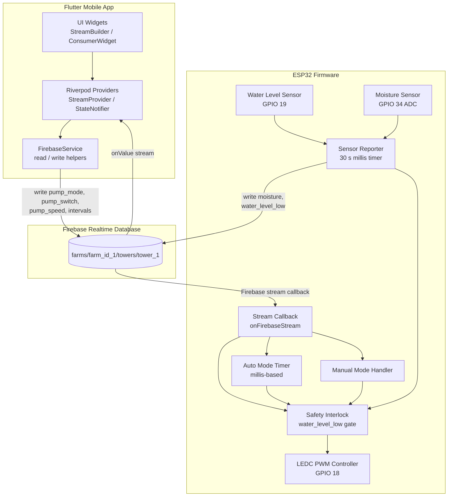

# Design Document — Hydroponics Farm Management System

## Overview

The hydroponics farm management system is a three-tier IoT application:

1. **Firebase Realtime Database** — the central data store and real-time communication bus.
2. **ESP32 Firmware (C++/Arduino)** — runs on each tower's microcontroller; reads sensors, controls the pump via PWM, and syncs state with Firebase.
3. **Flutter Mobile App** — the operator-facing UI; subscribes to Firebase for live data and writes control commands back to the database.

The firmware and the mobile app never communicate directly. All coordination flows through Firebase, which acts as a shared state machine. The firmware is the authoritative source for `pump_state` and sensor readings; the mobile app is the authoritative source for operator intent (`pump_mode`, `pump_switch`, `pump_speed`, `interval_on_min`, `interval_off_min`).

### Key Design Decisions

- **Firebase as message bus**: Using Firebase Realtime Database's streaming capability avoids the need for a custom MQTT broker or REST polling loop. Both the ESP32 and the Flutter app maintain persistent WebSocket-based streams.
- **Non-blocking firmware loop**: All timing on the ESP32 uses `millis()`-based state machines rather than `delay()` calls, ensuring the main loop remains responsive to stream callbacks, sensor reads, and safety checks simultaneously.
- **Safety interlock as highest-priority gate**: The water-level check runs on every pump activation path (auto timer tick, manual switch, mode change) so it cannot be bypassed.
- **Riverpod for Flutter state management**: `StreamProvider` wraps the Firebase `onValue` stream, giving widgets reactive rebuilds without manual `setState` calls and making the data layer easily testable.

---

## Architecture



### Data Flow Summary

| Direction | Actor | Path | Fields |
|---|---|---|---|
| App → DB | Flutter app | `towers/tower_1` | `pump_mode`, `pump_switch`, `pump_speed`, `interval_on_min`, `interval_off_min` |
| DB → ESP32 | Firebase stream | `towers/tower_1` | all control fields |
| ESP32 → DB | Firmware | `towers/tower_1` | `pump_state` |
| ESP32 → DB | Firmware | `towers/tower_1/sensors` | `moisture`, `water_level_low` |
| DB → App | Firebase stream | `towers/tower_1` | all fields (read-only display) |

---

## Components and Interfaces

### 1. Firebase Realtime Database

The database is the sole integration point between the firmware and the mobile app. No direct network connection exists between them.

**Security rules** (recommended): Authenticated read/write for the farm path; unauthenticated access disabled.

### 2. ESP32 Firmware

The firmware is structured as a cooperative multitasking loop. All tasks share a single thread and must never block.

#### 2.1 Connectivity Manager

Responsible for WiFi connection and Firebase authentication.

```cpp
// Pseudocode — key responsibilities
void connectivitySetup() {
    WiFi.begin(SSID, PASSWORD);
    while (WiFi.status() != WL_CONNECTED) { delay(100); }
    Firebase.begin(&config, &auth);
    Firebase.reconnectWiFi(true);
    Firebase.beginStream(streamData, TOWER_PATH);
    Firebase.setStreamCallback(streamData, onFirebaseStream, onStreamTimeout);
}

void connectivityLoop() {
    // Non-blocking reconnect check
    if (WiFi.status() != WL_CONNECTED) {
        WiFi.reconnect();
    }
}
```

#### 2.2 Stream Callback Handler (`onFirebaseStream`)

Dispatches incoming Firebase changes to the appropriate subsystem. Runs within a single callback invocation.

```cpp
void onFirebaseStream(FirebaseStream data) {
    String path = data.dataPath();
    if (path == "/pump_mode")         handleModeChange(data.stringData());
    else if (path == "/pump_speed")   handleSpeedChange(data.intData());
    else if (path == "/pump_switch")  handleSwitchChange(data.boolData());
    else if (path == "/interval_on_min")  autoTimer.setOnInterval(data.intData());
    else if (path == "/interval_off_min") autoTimer.setOffInterval(data.intData());
}
```

#### 2.3 Auto Mode Timer

A non-blocking state machine using `millis()`.

```cpp
struct AutoTimer {
    unsigned long lastToggleMs = 0;
    bool pumpOn = false;
    unsigned long onIntervalMs = 0;   // interval_on_min * 60000
    unsigned long offIntervalMs = 0;  // interval_off_min * 60000
    bool active = false;

    void tick() {
        if (!active) return;
        unsigned long elapsed = millis() - lastToggleMs;
        unsigned long target = pumpOn ? onIntervalMs : offIntervalMs;
        if (elapsed >= target) {
            pumpOn = !pumpOn;
            lastToggleMs = millis();
            applyPumpState(pumpOn);   // goes through safety interlock
        }
    }
};
```

#### 2.4 Safety Interlock

The single authoritative function for applying pump state. All code paths that activate or deactivate the pump call this function.

```cpp
void applyPumpState(bool requestedOn) {
    bool waterLow = digitalRead(WATER_LEVEL_PIN) == HIGH;
    bool actualOn = requestedOn && !waterLow;

    ledcWrite(PWM_CHANNEL, actualOn ? currentPumpSpeed : 0);

    if (pump_state != actualOn) {
        pump_state = actualOn;
        Firebase.setBool(writeData, TOWER_PATH "/pump_state", pump_state);
    }

    if (waterLow && requestedOn) {
        // Ensure pump_state false is written even if it was already false
        Firebase.setBool(writeData, TOWER_PATH "/pump_state", false);
    }
}
```

#### 2.5 PWM Controller

Initialized once in `setup()`:

```cpp
ledcSetup(PWM_CHANNEL, PWM_FREQ, PWM_RESOLUTION);  // ch 0, 5000 Hz, 8-bit
ledcAttachPin(PUMP_GPIO, PWM_CHANNEL);              // GPIO 18
```

Speed is applied via `ledcWrite(PWM_CHANNEL, duty)` where `duty` is 0–255.

#### 2.6 Sensor Reporter

Reads sensors every 30 seconds using a `millis()` timer:

```cpp
void sensorLoop() {
    if (millis() - lastSensorMs < SENSOR_INTERVAL_MS) return;
    lastSensorMs = millis();

    int moisture = analogRead(MOISTURE_PIN);          // GPIO 34
    bool waterLow = digitalRead(WATER_LEVEL_PIN);     // GPIO 19

    FirebaseJson json;
    json.set("moisture", moisture);
    json.set("water_level_low", waterLow);
    Firebase.updateNode(writeData, SENSORS_PATH, json);

    // Safety interlock re-evaluation on every sensor read
    if (waterLow) applyPumpState(false);
}
```

### 3. Flutter Mobile App

#### 3.1 Package Dependencies

| Package | Purpose |
|---|---|
| `firebase_core` | Firebase initialization |
| `firebase_database` | Realtime Database client |
| `flutter_riverpod` | Reactive state management |

#### 3.2 Repository Layer (`TowerRepository`)

Encapsulates all Firebase read/write operations. Returns typed Dart objects.

```dart
class TowerRepository {
  final DatabaseReference _ref;

  TowerRepository(FirebaseDatabase db)
      : _ref = db.ref('farms/farm_id_1/towers/tower_1');

  Stream<TowerState> watchTower() =>
      _ref.onValue.map((event) => TowerState.fromSnapshot(event.snapshot));

  Future<void> setPumpMode(String mode) =>
      _ref.child('pump_mode').set(mode);

  Future<void> setPumpSwitch(bool on) =>
      _ref.child('pump_switch').set(on);

  Future<void> setPumpSpeed(int speed) =>
      _ref.child('pump_speed').set(speed);

  Future<void> setIntervals(int onMin, int offMin) =>
      _ref.update({'interval_on_min': onMin, 'interval_off_min': offMin});
}
```

#### 3.3 Riverpod Providers

```dart
// Provides the live tower state stream
final towerStreamProvider = StreamProvider<TowerState>((ref) {
  return ref.watch(towerRepositoryProvider).watchTower();
});

// Connection status derived from stream errors
final connectionStatusProvider = Provider<bool>((ref) {
  return ref.watch(towerStreamProvider).hasValue;
});
```

#### 3.4 UI Structure

```
TowerDashboard (ConsumerWidget)
├── ConnectionStatusBanner        (shows when disconnected)
├── SensorCard
│   ├── MoistureDisplay           (moisture integer)
│   └── WaterLevelDisplay         (Good / Low)
├── ModeSwitchTile                (pump_mode toggle)
├── AutoModePanel (visible when pump_mode == 'auto')
│   ├── IntervalOnField           (interval_on_min)
│   └── IntervalOffField          (interval_off_min)
└── ManualModePanel (visible when pump_mode == 'manual')
    ├── PumpSwitchTile            (pump_switch / reflects pump_state)
    └── SpeedSlider               (0–100% → 0–255)
```

---

## Data Models

### Firebase Database Schema

```
farms/
  farm_id_1/
    towers/
      tower_1/
        pump_speed:       Integer  (0–255)
        pump_mode:        String   ('auto' | 'manual')
        pump_state:       Boolean
        pump_switch:      Boolean
        interval_on_min:  Integer  (> 0)
        interval_off_min: Integer  (> 0)
        sensors/
          moisture:         Integer  (ADC raw value, 0–4095)
          water_level_low:  Boolean
```

### ESP32 Firmware State (in-memory)

```cpp
struct FirmwareState {
    // Control fields (written by app, read by firmware)
    String  pump_mode;          // "auto" | "manual"
    int     pump_speed;         // 0–255
    bool    pump_switch;        // operator intent in manual mode
    unsigned long interval_on_ms;
    unsigned long interval_off_ms;

    // Sensor / output fields (written by firmware)
    bool    pump_state;         // current actual pump on/off
    int     moisture;
    bool    water_level_low;
};
```

### Flutter Dart Model (`TowerState`)

```dart
class TowerState {
  final int pumpSpeed;          // 0–255
  final String pumpMode;        // 'auto' | 'manual'
  final bool pumpState;         // actual pump on/off
  final bool pumpSwitch;        // operator intent
  final int intervalOnMin;
  final int intervalOffMin;
  final int moisture;
  final bool waterLevelLow;

  const TowerState({
    required this.pumpSpeed,
    required this.pumpMode,
    required this.pumpState,
    required this.pumpSwitch,
    required this.intervalOnMin,
    required this.intervalOffMin,
    required this.moisture,
    required this.waterLevelLow,
  });

  factory TowerState.fromSnapshot(DataSnapshot snapshot) {
    final data = Map<String, dynamic>.from(snapshot.value as Map);
    final sensors = Map<String, dynamic>.from(data['sensors'] as Map? ?? {});
    return TowerState(
      pumpSpeed:      (data['pump_speed']       as int?)  ?? 0,
      pumpMode:       (data['pump_mode']         as String?) ?? 'manual',
      pumpState:      (data['pump_state']        as bool?) ?? false,
      pumpSwitch:     (data['pump_switch']       as bool?) ?? false,
      intervalOnMin:  (data['interval_on_min']   as int?)  ?? 1,
      intervalOffMin: (data['interval_off_min']  as int?)  ?? 1,
      moisture:       (sensors['moisture']       as int?)  ?? 0,
      waterLevelLow:  (sensors['water_level_low'] as bool?) ?? false,
    );
  }

  /// Maps 0–255 pump_speed to a 0.0–1.0 slider value
  double get speedPercent => pumpSpeed / 255.0;

  /// Maps a 0.0–1.0 slider value to 0–255
  static int sliderToSpeed(double percent) => (percent * 255).round().clamp(0, 255);

  /// Returns display string for water level
  String get waterLevelDisplay => waterLevelLow ? 'Low' : 'Good';
}
```

### Validation Rules (Mobile App)

| Field | Rule |
|---|---|
| `interval_on_min` | Must parse as integer; must be ≥ 1 |
| `interval_off_min` | Must parse as integer; must be ≥ 1 |
| `pump_speed` (slider) | Clamped to 0–255 by `sliderToSpeed`; no free-text entry |
| `pump_mode` | Only toggled via switch; no free-text entry |

---

## Correctness Properties

*A property is a characteristic or behavior that should hold true across all valid executions of a system — essentially, a formal statement about what the system should do. Properties serve as the bridge between human-readable specifications and machine-verifiable correctness guarantees.*


### Property 1: TowerState Serialization Round-Trip

*For any* valid combination of tower control fields (`pump_speed`, `pump_mode`, `pump_state`, `pump_switch`, `interval_on_min`, `interval_off_min`) and sensor fields (`moisture`, `water_level_low`), serializing a `TowerState` to a Firebase-compatible `Map` and deserializing it back via `TowerState.fromSnapshot` should produce an equivalent object with all fields preserved.

**Validates: Requirements 1.2, 1.3**

---

### Property 2: Stream Callback Dispatches Mode Change

*For any* valid `pump_mode` value (`'auto'` or `'manual'`), when `onFirebaseStream` is called with path `/pump_mode` and that value, the firmware's internal `pump_mode` state should equal the received value within the same callback invocation.

**Validates: Requirements 3.1**

---

### Property 3: Stream Callback Applies Pump Speed to PWM

*For any* `pump_speed` integer in the range 0–255, when `onFirebaseStream` is called with path `/pump_speed` and that value while the pump is on and water level is not low, `ledcWrite` should be called with that exact duty cycle value.

**Validates: Requirements 3.2, 6.2**

---

### Property 4: Manual Mode — Pump Switch Controls Pump State

*For any* boolean `pump_switch` value, when `pump_mode` is `'manual'` and `water_level_low` is `false`, calling `onFirebaseStream` with path `/pump_switch` and that value should result in the pump state matching `pump_switch`.

**Validates: Requirements 3.3, 5.1, 5.2**

---

### Property 5: Auto Timer Cycles at Correct Intervals

*For any* positive `interval_on_min` and `interval_off_min` values, the auto mode timer should toggle the pump state exactly when the elapsed `millis()` time equals or exceeds the corresponding interval in milliseconds, and should not toggle before that threshold.

**Validates: Requirements 3.4, 4.1**

---

### Property 6: Pump State Changes Are Written to Firebase

*For any* pump state transition (on→off or off→on) triggered by either auto mode timer or manual mode switch, `Firebase.setBool` should be called with the path `pump_state` and the new boolean value.

**Validates: Requirements 4.3, 5.3**

---

### Property 7: Auto Mode Ignores Pump Switch

*For any* boolean `pump_switch` value, when `pump_mode` is `'auto'`, calling `onFirebaseStream` with path `/pump_switch` and that value should produce no change in pump state.

**Validates: Requirements 5.4**

---

### Property 8: PWM Duty Cycle Matches Pump On/Off State

*For any* `pump_speed` in 0–255 and any pump on/off state, when the pump is off (`pump_state = false`), `ledcWrite` should always be called with duty cycle 0 regardless of `pump_speed`; when the pump is on (`pump_state = true`) and `water_level_low` is `false`, `ledcWrite` should be called with the current `pump_speed` value.

**Validates: Requirements 6.3, 6.4**

---

### Property 9: Sensor Values Are Written to Firebase

*For any* `moisture` integer and `water_level_low` boolean read from the sensors, the firmware should write those exact values to the Firebase path `farms/farm_id_1/towers/tower_1/sensors` during the sensor reporting cycle.

**Validates: Requirements 7.3**

---

### Property 10: Safety Interlock Overrides All Pump Activation

*For any* combination of `pump_mode` (`'auto'` or `'manual'`), `pump_switch` (true or false), and auto timer state (on or off), when `water_level_low` is `true`, `ledcWrite` should always be called with duty cycle 0 and `pump_state` should be `false` in Firebase — regardless of any other control inputs.

**Validates: Requirements 8.1, 8.2, 8.3**

---

### Property 11: Safety Interlock Clears on Water Restored

*For any* `pump_mode` and `pump_switch` state, after `water_level_low` transitions from `true` to `false`, the pump should resume behaving according to the current `pump_mode` — meaning manual mode respects `pump_switch` and auto mode resumes timer-based cycling.

**Validates: Requirements 8.4**

---

### Property 12: Water Level Display Maps Boolean to String

*For any* `water_level_low` boolean value, `TowerState.waterLevelDisplay` should return `'Good'` when the value is `false` and `'Low'` when the value is `true`.

**Validates: Requirements 10.2**

---

### Property 13: Speed Slider Mapping Is Monotonic and Bounded

*For any* slider percentage `p` in the range 0.0–1.0, `TowerState.sliderToSpeed(p)` should return an integer in the range 0–255. Additionally, for any two percentages `p1 ≤ p2`, `sliderToSpeed(p1) ≤ sliderToSpeed(p2)` (monotonically non-decreasing).

**Validates: Requirements 12.4**

---

### Property 14: Mode Switch Reflects and Writes Pump Mode

*For any* `pump_mode` value (`'auto'` or `'manual'`), `TowerState.fromSnapshot` should parse it correctly and the mode switch widget should reflect it. When the operator toggles the switch, the opposite mode should be written to Firebase.

**Validates: Requirements 11.1, 11.2**

---

### Property 15: Mode Determines Visible Control Panel

*For any* `pump_mode` value, the Auto Mode control panel should be visible if and only if `pump_mode == 'auto'`, and the Manual Mode control panel should be visible if and only if `pump_mode == 'manual'`. Both panels should never be simultaneously visible or simultaneously hidden.

**Validates: Requirements 11.3, 12.1, 13.1**

---

### Property 16: Interval Validation Rejects Invalid Input

*For any* string that is not a representation of a positive integer (i.e., non-numeric strings, empty strings, zero, negative integers, or decimal numbers), the interval validation function should return a non-null error message and should not invoke any Firebase write operation.

**Validates: Requirements 13.3**

---

### Property 17: Interval Round-Trip Through Firebase

*For any* positive integer interval value, writing it to Firebase via `TowerRepository.setIntervals` and then reading it back via `TowerState.fromSnapshot` should produce the same integer value for both `intervalOnMin` and `intervalOffMin`.

**Validates: Requirements 13.2, 13.4**

---

## Error Handling

### ESP32 Firmware

| Scenario | Handling |
|---|---|
| WiFi connection lost | `WiFi.reconnect()` called in main loop; no blocking; pump continues operating on last known state |
| Firebase stream timeout | `onStreamTimeout` callback re-calls `Firebase.beginStream`; last known control values remain active |
| Firebase write failure | Log error via `Serial`; retry on next sensor cycle or state change; do not halt pump control |
| `water_level_low` goes high | Safety interlock immediately sets PWM to 0 and writes `pump_state = false`; blocks all activation |
| Invalid stream data type | Guard with `data.dataType()` check before casting; ignore malformed payloads |
| ADC read out of range | Clamp `moisture` to 0–4095 before writing; log anomaly |

### Flutter Mobile App

| Scenario | Handling |
|---|---|
| Firebase connection lost | `connectionStatusProvider` becomes false; `ConnectionStatusBanner` shown; UI remains functional with last cached values |
| Stream error | `AsyncValue.error` state in Riverpod; error widget shown in place of data |
| Invalid interval input | Inline validation error message shown; Firebase write blocked; field highlighted in red |
| Firebase write failure | `Future` error caught; snackbar shown to operator; no silent failure |
| Null/missing fields in snapshot | `TowerState.fromSnapshot` uses null-coalescing defaults for all fields; app never crashes on partial data |

---

## Testing Strategy

### Overview

The system spans three distinct technology stacks (C++/Arduino, Firebase, Flutter/Dart). Testing is organized per layer.

### ESP32 Firmware Testing

**Unit Tests (native C++ with GoogleTest or Unity)**

The firmware logic is extracted into testable pure functions and state machines that can be compiled and tested on a host machine without hardware:

- `AutoTimer::tick()` — test state transitions with mocked `millis()` values
- `applyPumpState()` — test PWM output and Firebase write calls with mocked `ledcWrite` and `Firebase.setBool`
- `onFirebaseStream()` — test dispatch logic with mocked stream data objects
- `sensorLoop()` — test timing and write calls with mocked `analogRead`, `digitalRead`, and Firebase

**Property-Based Tests (using [rapidcheck](https://github.com/emil-e/rapidcheck) for C++)**

Each property test runs a minimum of 100 iterations with randomly generated inputs.

| Property | Generator | Assertion |
|---|---|---|
| Property 3: Stream applies pump_speed to PWM | `pump_speed` ∈ [0, 255] | `ledcWrite` called with exact value when pump on |
| Property 4: Manual mode pump_switch | `pump_switch` ∈ {true, false} | pump state matches switch when mode='manual', water ok |
| Property 5: Auto timer cycles at correct intervals | `on_min`, `off_min` ∈ [1, 60] | toggle occurs at correct millis threshold |
| Property 7: Auto mode ignores pump_switch | `pump_switch` ∈ {true, false} | no pump state change when mode='auto' |
| Property 8: PWM matches pump state | `pump_speed` ∈ [0, 255], `pump_state` ∈ {true, false} | PWM=0 when off, PWM=speed when on |
| Property 9: Sensor values written to Firebase | `moisture` ∈ [0, 4095], `water_level_low` ∈ {true, false} | Firebase write contains exact values |
| Property 10: Safety interlock overrides all | `pump_mode`, `pump_switch`, timer state | PWM=0 and pump_state=false when water_low=true |
| Property 11: Safety interlock clears | `pump_mode`, `pump_switch` | pump resumes correct behavior after water_low→false |

**Tag format for each test:**
```cpp
// Feature: hydroponics-farm-management, Property 10: Safety interlock overrides all pump activation
```

### Flutter Mobile App Testing

**Unit Tests (flutter_test + mockito)**

- `TowerState.fromSnapshot()` — test parsing with various snapshot structures
- `TowerState.waterLevelDisplay` — test string mapping
- `TowerState.sliderToSpeed()` — test boundary values and mapping
- `TowerRepository` — test correct Firebase paths and write values using `MockDatabaseReference`
- Interval validation function — test valid and invalid input strings

**Property-Based Tests (using [fast_check](https://pub.dev/packages/fast_check) or [dart_test_with_hypothesis](https://pub.dev/packages/hypothesis) for Dart)**

Each property test runs a minimum of 100 iterations.

| Property | Generator | Assertion |
|---|---|---|
| Property 1: TowerState round-trip | Random `TowerState` fields | `fromSnapshot(toMap(state))` == original state |
| Property 12: Water level display | `water_level_low` ∈ {true, false} | Returns 'Good' or 'Low' correctly |
| Property 13: Slider mapping monotonic | `p` ∈ [0.0, 1.0] | Result ∈ [0, 255]; monotonically non-decreasing |
| Property 14: Mode switch reflects mode | `pump_mode` ∈ {'auto', 'manual'} | Widget reflects mode; toggle writes opposite |
| Property 15: Panel visibility | `pump_mode` ∈ {'auto', 'manual'} | Exactly one panel visible |
| Property 16: Interval validation | Random strings including invalid | Invalid inputs rejected; no Firebase write |
| Property 17: Interval round-trip | `interval` ∈ [1, 1440] | Write then read returns same integer |

**Tag format for each test:**
```dart
// Feature: hydroponics-farm-management, Property 1: TowerState serialization round-trip
```

**Widget Tests (flutter_test)**

- `ConnectionStatusBanner` appears when stream has error
- `AutoModePanel` / `ManualModePanel` visibility based on `pump_mode`
- Sensor display updates when stream emits new `TowerState`
- Pump switch reflects `pump_state` changes from Firebase

**Integration Tests**

- Firebase Realtime Database write → stream update latency (Requirement 1.4)
- End-to-end: app writes `pump_mode` → Firebase → firmware stream callback updates mode

### Testing Pyramid Summary

```
         /\
        /  \  Integration Tests
       /----\  (Firebase + hardware-in-loop)
      /      \
     / Widget  \  Widget Tests (Flutter)
    /  Tests    \
   /------------\
  /  Unit Tests  \  Unit + Property Tests
 /  + PBT Tests   \  (per layer, mocked deps)
/------------------\
```
