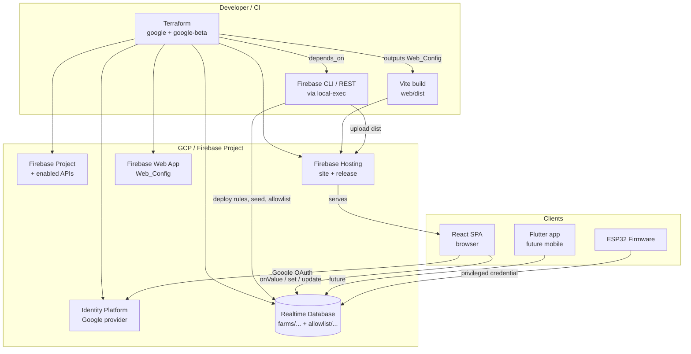

# Design Document — Web App, Google OAuth & Terraform Delivery

## Overview

We deliver the operator interface as a new **React + TypeScript SPA** served by **Firebase
Hosting**, authenticated with **Google OAuth** and gated by an **allowlist**. The existing
Firebase Realtime Database (RTDB) backend, its schema, and the ESP32 firmware are unchanged;
the web client is simply a second client alongside the retained Flutter codebase (kept for
future Android/iOS, not deployed here).

All cloud infrastructure is provisioned with **Terraform** using the `google` and
`google-beta` providers, and the web build is deployed through the Terraform workflow.

### Key Design Decisions

- **Two clients, one backend.** The React web app and the Flutter mobile app are independent
  frontends over the same RTDB. No backend contract changes — the web app ports the Dart
  `TowerState` / `TowerRepository` semantics 1:1.
- **Static SPA on Hosting.** A realtime dashboard needs no SSR; a Vite static bundle on
  Firebase Hosting is the simplest correct fit. Realtime is a thin `onValue` subscription hook.
- **Authoritative authorization in rules, UX gate in client.** The client checks allowlist
  membership for a friendly "access denied" screen, but the RTDB security rules are the real
  boundary — they must hold even if the client is bypassed.
- **Firmware bypasses user rules.** The firmware uses a privileged credential (legacy database
  secret / service-account token), so tightening user rules to the allowlist does not affect
  sensor/`pump_state` writes.
- **Terraform for infra + a thin CLI seam for what TF can't do natively.** Terraform natively
  provisions the project, Firebase enablement, RTDB instance, web app, Identity Platform +
  Google IdP, and the Hosting site. RTDB **security-rules deploy, seed data, allowlist seeding,
  and static-file upload** are not first-class Terraform resources, so they are executed via
  the Firebase CLI/REST wrapped in `null_resource`/`local-exec` and ordered with `depends_on`.
  This keeps a single `terraform apply` end-to-end while being honest about provider limits.

---

## Architecture



### Deployment Flow

1. `terraform apply` provisions project + Firebase resources and outputs `Web_Config`.
2. Build step renders outputs into `web/.env`, then `vite build` → `web/dist`.
3. Terraform-invoked CLI deploys RTDB rules, seeds data + allowlist, and publishes the Hosting
   release from `web/dist`.

---

## Components and Interfaces

### 1. Web App (`web/`)

Structure:

```
web/
  index.html  vite.config.ts  package.json  tsconfig.json  .env.example
  src/
    firebase.ts             # initializeApp, getAuth, getDatabase (from import.meta.env)
    auth/
      AuthProvider.tsx      # onAuthStateChanged context; user + allowlist status
      useAuth.ts            # hook exposing { user, status, signIn, signOut }
      SignInScreen.tsx      # Google sign-in button + error display
      AccessDenied.tsx      # shown when authenticated but not in allowlist
    data/
      towerState.ts         # TowerState type + parse/serialize/computed (port of Dart)
      useTower.ts           # onValue subscription + .info/connected
      towerRepository.ts    # setPumpMode/setPumpSwitch/setPumpSpeed/setIntervals
    utils/validateInterval.ts
    components/
      ConnectionBanner.tsx  SensorCard.tsx  ModeSwitch.tsx
      AutoModePanel.tsx     ManualModePanel.tsx  TowerDashboard.tsx
    App.tsx  main.tsx
  test/                     # Vitest + fast-check property tests
```

#### 1.1 Firebase init (`firebase.ts`)

```ts
import { initializeApp } from 'firebase/app';
import { getAuth, GoogleAuthProvider } from 'firebase/auth';
import { getDatabase } from 'firebase/database';

const app = initializeApp({
  apiKey: import.meta.env.VITE_FB_API_KEY,
  authDomain: import.meta.env.VITE_FB_AUTH_DOMAIN,
  projectId: import.meta.env.VITE_FB_PROJECT_ID,
  appId: import.meta.env.VITE_FB_APP_ID,
  messagingSenderId: import.meta.env.VITE_FB_SENDER_ID,
  databaseURL: import.meta.env.VITE_FB_DATABASE_URL,
});
export const auth = getAuth(app);
export const db = getDatabase(app);
export const googleProvider = new GoogleAuthProvider();
```

#### 1.2 Auth context

```ts
type AuthStatus = 'loading' | 'signed_out' | 'not_allowed' | 'allowed';
// onAuthStateChanged -> if user, read /allowlist/{uid}; set status accordingly.
```

`App.tsx` renders by status: `loading` → spinner; `signed_out` → `SignInScreen`;
`not_allowed` → `AccessDenied`; `allowed` → `TowerDashboard`.

#### 1.3 Realtime hook (`useTower.ts`)

```ts
export function useTower() {
  const [state, setState] = useState<TowerState | null>(null);
  const [connected, setConnected] = useState(true);
  useEffect(() => {
    const towerRef = ref(db, 'farms/farm_id_1/towers/tower_1');
    const off1 = onValue(towerRef, (snap) => setState(parseTowerState(snap.val())));
    const off2 = onValue(ref(db, '.info/connected'), (s) => setConnected(!!s.val()));
    return () => { off1(); off2(); };
  }, []);
  return { state, connected };
}
```

#### 1.4 Repository (`towerRepository.ts`) — 1:1 with Dart

```ts
const towerRef = () => ref(db, 'farms/farm_id_1/towers/tower_1');
export const setPumpMode   = (m: 'auto' | 'manual') => set(child(towerRef(), 'pump_mode'), m);
export const setPumpSwitch = (on: boolean)          => set(child(towerRef(), 'pump_switch'), on);
export const setPumpSpeed  = (n: number)            => set(child(towerRef(), 'pump_speed'), n);
export const setIntervals  = (on: number, off: number) =>
  update(towerRef(), { interval_on_min: on, interval_off_min: off });
```

### 2. Terraform (`infra/terraform/`)

```
infra/terraform/
  versions.tf     # required_providers google + google-beta, backend "gcs"
  variables.tf    # project_id, billing_account, region, site_id, authorized_domains,
                  #   oauth_client_id (sensitive), oauth_client_secret (sensitive),
                  #   allowlist_uids (list), admin_credentials_path (sensitive)
  main.tf         # project + APIs + firebase project
  auth.tf         # google_identity_platform_config + default_supported_idp_config (google.com)
  database.tf     # google_firebase_database_instance
  webapp.tf       # google_firebase_web_app + data source google_firebase_web_app_config
  hosting.tf      # google_firebase_hosting_site + deploy (see below)
  deploy.tf       # null_resource local-exec: rules, seed, allowlist, hosting upload
  outputs.tf      # web_config, database_url, hosting_url
  terraform.tfvars.example
```

### 3. Existing backend (unchanged)

RTDB schema `farms/farm_id_1/towers/tower_1` and firmware as defined in the
`hydroponics-farm-management` spec.

---

## Data Models

### TowerState (TypeScript, port of Dart)

```ts
export interface TowerState {
  pumpSpeed: number;        // 0–255
  pumpMode: 'auto' | 'manual';
  pumpState: boolean;       // firmware-owned
  pumpSwitch: boolean;
  intervalOnMin: number;
  intervalOffMin: number;
  moisture: number;         // 0–4095
  waterLevelLow: boolean;
}

export function parseTowerState(raw: any): TowerState { /* null-coalescing defaults */ }
export function toMap(s: TowerState): Record<string, unknown> { /* incl. nested sensors */ }
export const sliderToSpeed = (p: number) =>
  Math.min(255, Math.max(0, Math.round(p * 255)));   // clamp 0–255
export const speedPercent = (s: TowerState) => s.pumpSpeed / 255;
export const waterLevelDisplay = (s: TowerState) => (s.waterLevelLow ? 'Low' : 'Good');
```

### Allowlist node

```
allowlist/
  <uid>: true
```

### Firebase Web SDK config (from Terraform output)

`{ apiKey, authDomain, projectId, appId, messagingSenderId, databaseURL }` → rendered to
`web/.env` (`VITE_FB_*`). Never committed.

---

## Security Rules Design

`firebase/database.rules.json`:

```json
{
  "rules": {
    "allowlist": {
      ".read": "auth != null",
      ".write": false
    },
    "farms": {
      ".read":  "auth != null && root.child('allowlist').child(auth.uid).val() === true",
      ".write": "auth != null && root.child('allowlist').child(auth.uid).val() === true"
    },
    "$other": { ".read": false, ".write": false }
  }
}
```

- `/allowlist` write is denied to clients; entries are seeded by Terraform via a privileged
  credential (Admin SDK / database secret), which bypasses rules.
- The firmware's legacy secret bypasses rules entirely, so sensor/`pump_state` writes are
  unaffected. If the firmware is ever migrated to a UID-bearing token, that UID must be added
  to `/allowlist`.

---

## Terraform Resource Map

| Concern | Mechanism | Notes |
|---|---|---|
| GCP project + APIs | `google_project` (optional), `google_project_service` | firebase, identitytoolkit, firebasedatabase, firebasehosting APIs |
| Firebase enablement | `google_firebase_project` (google-beta) | adopts project into Firebase |
| RTDB instance | `google_firebase_database_instance` (google-beta) | region + instance id |
| Web app | `google_firebase_web_app` + data `google_firebase_web_app_config` | source of Web_Config outputs |
| Google sign-in | `google_identity_platform_config` + `google_identity_platform_default_supported_idp_config` | needs `oauth_client_id`/`secret` vars |
| Hosting site | `google_firebase_hosting_site` (google-beta) | site id |
| **RTDB rules deploy** | `null_resource` + `local-exec` (`firebase deploy --only database`) | not a native TF resource |
| **Seed data** | `null_resource` + `local-exec` (REST PUT of `seed_data.json`) | idempotent PUT |
| **Allowlist seed** | `null_resource` + `local-exec` (REST PATCH from `allowlist_uids`) | idempotent |
| **Static upload** | `null_resource` + `local-exec` (`firebase deploy --only hosting`) or `google_firebase_hosting_release` | file upload not native to TF |
| State | `backend "gcs"` | remote + locking |

**Provider limitations (explicit):** Terraform's Firebase/Google providers cannot upload
Hosting files, set RTDB security rules, or write RTDB data. These are handled by the
Firebase CLI/REST invoked from `local-exec`, ordered via `depends_on` so a single
`terraform apply` runs end-to-end. Prerequisites: a billing account (Blaze) is required for
Identity Platform and RTDB provisioning, and the Google OAuth client id/secret must come from
the GCP OAuth consent screen.

---

## Correctness Properties

Ported client-logic properties (analogous to the original spec's Properties 1, 12–17), plus
two new authorization properties.

### Property W1: TowerState Serialization Round-Trip
*For any* valid combination of tower fields, `parseTowerState(toMap(state))` produces an
object equal to the original. **Validates: Requirements 4.1, 4.3**

### Property W2: Water Level Display Maps Boolean to String
*For any* `waterLevelLow` boolean, `waterLevelDisplay` returns `'Good'` when false and `'Low'`
when true. **Validates: Requirement 6.2**

### Property W3: Speed Slider Mapping Is Monotonic and Bounded
*For any* `p ∈ [0,1]`, `sliderToSpeed(p) ∈ [0,255]`; and for `p1 ≤ p2`,
`sliderToSpeed(p1) ≤ sliderToSpeed(p2)`. **Validates: Requirement 6.4**

### Property W4: Mode Determines Visible Panel
*For any* `pumpMode`, the Auto panel is visible iff `pumpMode == 'auto'` and the Manual panel
iff `pumpMode == 'manual'`; never both/neither. **Validates: Requirement 6.3**

### Property W5: Interval Validation Rejects Invalid Input
*For any* string that is not a positive integer, `validateInterval` returns an error and no
RTDB write occurs. **Validates: Requirement 6.5**

### Property W6: Interval Round-Trip
*For any* positive integer, writing via `setIntervals` then parsing back yields the same
`intervalOnMin`/`intervalOffMin`. **Validates: Requirements 5.4**

### Property W7: Access Requires Allowlist Membership
*For any* authenticated user, the dashboard is reachable iff `/allowlist/{uid} === true`;
otherwise the app shows the access-denied state and issues no `farms/` read/write.
**Validates: Requirements 3.2, 3.3, 7.1**

### Property W8: Firmware-Owned Fields Are Never Written by the Web App
*For any* operator action, no code path writes `pump_state`, `moisture`, or `water_level_low`.
**Validates: Requirement 5.5**

---

## Error Handling

### Web App

| Scenario | Handling |
|---|---|
| Google sign-in popup blocked | Fall back to `signInWithRedirect`; show hint |
| Auth error (network, cancel) | Show message on `SignInScreen`; stay signed out |
| Authenticated but not allowlisted | `AccessDenied` screen; no `farms/` access; offer sign-out |
| RTDB disconnected | `ConnectionBanner` shown via `.info/connected`; last values retained |
| Partial/missing snapshot fields | `parseTowerState` null-coalescing defaults; never crash |
| Invalid interval input | Inline error; write blocked |
| RTDB write rejected by rules | Catch promise rejection; toast; no silent failure |

### Terraform / Deploy

| Scenario | Handling |
|---|---|
| Missing billing account | `terraform plan` fails fast with clear variable validation |
| Missing OAuth client id/secret | Google IdP resource errors; documented prerequisite |
| CLI step fails (rules/seed/upload) | `local-exec` non-zero exit fails the apply; re-run is idempotent |
| Re-apply with unchanged assets | Hosting release/seed steps are idempotent (no duplication) |
| State drift | Remote GCS backend with locking prevents concurrent corruption |

---

## Testing Strategy

### Web App
- **Unit tests (Vitest):** `parseTowerState`/`toMap`, `waterLevelDisplay`, `sliderToSpeed`,
  `validateInterval`, repository path/value assertions with a mocked `database`.
- **Property tests (Vitest + fast-check, ≥100 iterations):** Properties W1–W6.
- **Component tests (Vitest + Testing Library):** connection banner visibility, panel
  visibility by mode (W4), access-denied gating (W7), firmware-field write guard (W8).
- **Tag format:** `// Feature: web-app-google-auth, Property W3: Speed slider mapping`.

### Infrastructure
- `terraform fmt -check` and `terraform validate` in CI.
- `terraform plan` against a sandbox project (no apply) as a smoke check.
- Post-deploy manual smoke: sign in with an allowlisted account → dashboard loads and controls
  write; non-allowlisted account → access denied.

### Testing Pyramid

```
        /\
       /  \  Manual smoke (auth + deploy)
      /----\
     / comp. \  Component tests (Vitest + RTL)
    /  tests  \
   /----------\
  / unit + PBT \  Unit + property tests (Vitest + fast-check)
 /--------------\
/  terraform     \  fmt / validate / plan
------------------
```
